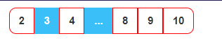

# Pagination Options

## Currently v2.0.0


<br/>




<br/>

# Coming Soon 
## For HTML

#### CSS style: `/style.css`


```bash css
/*******************************************/
:root {
    --disabledButtonBg: #3ABFF8;
    --borderPageColor: red;
    --borderRadius: 0.5rem;
    --btn-focus-scale: 0.95;
    --align-main-div: center;
    --buttonSize: 30px;
    /* 1rem = 16px */
    --padding-mainDiv: 8px 0px;
    /* 
      --padding-mainDiv: top/bottom left/right;
    */
}

.buttonDisable {
    color: white !important;
    background-color: var(--disabledButtonBg) !important;
    cursor: default !important;
}

.buttonPage {
    --borderPage: var(--borderPageColor) !important;
}

.mainDiv {
    display: flex;
    justify-content: var(--align-main-div);
    align-items: center;
    padding: 8px 0;
}

.button {
    display: inline-flex;
    flex-shrink: 0;
    cursor: pointer;
    -webkit-user-select: none;
    user-select: none;
    flex-wrap: wrap;
    align-items: center;
    justify-content: center;


    text-align: center;

    transition-duration: 200ms;
    transition-timing-function: cubic-bezier(0.4, 0, 0.2, 1);

    border-radius: var(--borderRadius, 0.5rem);
    border: 1px solid var(--borderPage, transparent);

    font-weight: 600;
    text-transform: uppercase;
    height: var(--buttonSize, 2rem)
        /* 32px */
    ;
    padding-left: calc(var(--buttonSize, 2rem) - 1.25rem)
        /* 12px */
    ;
    padding-right: calc(var(--buttonSize, 2rem) - 1.25rem)
        /* 12px */
    ;
    min-height: var(--buttonSize, 2rem)
        /* 32px */
    ;
    font-size: calc(var(--buttonSize, 2rem) - 1.125rem)
        /* 14px */
    ;

}

.button:hover {
    background-color: var(--borderPage);
    color: white !important;
}

.button:active:hover,
.button:active:focus {
    animation: none;
    transform: scale(var(--btn-focus-scale, 0.95));
}


.button-group {
    display: flex;
    flex-wrap: wrap;
}

.button-group button {
    border-radius: 0px;
}

.button-group button:nth-child(1) {
    --borderRadius: 0.5rem 0 0 0.5rem;
    border-radius: var(--borderRadius);
}

.button-group button:nth-last-child(1) {
    --borderRadius: 0 0.5rem 0.5rem 0;
    border-radius: var(--borderRadius);
}
```

## Customize:
### Edit CSS style: `/style.css`

```bash
:root {
    --disabledButtonBg: #3ABFF8;
    --borderPageColor: red;
    --borderRadius: 0.5rem;
    --btn-focus-scale: 0.95;
    --align-main-div: center;
    --buttonSize: 30px;
    /* 1rem = 16px */
    --padding-mainDiv: 8px 0px;
    /* 
      --padding-mainDiv: top/bottom left/right;
    */
}
```

| CSS Variable                | Description                            |
| --------------------------- | -------------------------------------- |
| --disabledButtonBg:         | Disable button background color        |
| --borderPageColor:          | Active button background color         |
| --borderRadius: 0.5rem;     | Border radius for first and last child |
| --align-main-div: center;   | Parent Div align                       |
| --buttonSize: 30px;         | Button size                            |
| --padding-mainDiv: 8px 0px; | For parent div top and bottom padding  |


# For React App:

| props                       | Description                            |
| --------------------------- | -------------------------------------- |
| page                        | Current page number                    |
| lastPage:                   | Total page. Like                       |
| --borderRadius: 0.5rem;     | Border radius for first and last child |
| --align-main-div: center;   | Parent Div align                       |
| --buttonSize: 30px;         | Button size                            |
| --padding-mainDiv: 8px 0px; | For parent div top and bottom padding  |

### How to get lastPage?


const [getPage, setPage] = useState(1); const [show, setShow] = useState(50); const [lastPage, setLastPage] = useState(); 

```javascript
const [getPage, setPage] = useState(1);
const [show, setShow] = useState(10);
const [lastPage, setLastPage] = useState(0)

const totalFiles = 100;
useEffect(() => { 
    const lastPage =  Math.ceil(totalFiles / show); // lastPage = 10
    setLastPage(lastPage)
}, [])

const pageHandle = (jump) => { setPage(jump) }

```
#### Example:

```javascript
const [getPage, setPage] = useState(1);
const [show, setShow] = useState(10);
const [lastPage, setLastPage] = useState(0)

const totalFiles = 100;
useEffect(() => { 
    const lastPage =  Math.ceil(totalFiles / show); // lastPage = 10
    setLastPage(lastPage)
}, [])

const pageHandle = (jump) => {
     setPage(jump)
}
return(
    <div>
         <Pagination 
            lastPage={lastPage} 
            page={getPage} 
            pageHandle={pageHandle}
        />
    </div>
)
```


```javascript


const Pagination = ({ pageHandle = () => { }, page, lastPage }) => {
    return (
        <div className='mainDiv'>
            <div className="button-group">

                {/* 
                
                1. WHEN PAGE NUMBER 1 IT HIDE 
                2. WHEN PAGE > 3 IT SHOW BUT 
                3. WHEN PAGE == 4 HIDE => THREE PAGE BUTTON. BECAUSE DOUBLE SHOW 3;
                4. WHEN PAGE > 5 => SHOW (.....) BUTTON. BECAUSE FOUR BUTTON HIDE INSTANTLY

             */}

                {
                    //  CASE: 01 AND 02
                    page > 3 &&
                    <>
                        <button
                            onClick={() => pageHandle(1)}
                            className="button buttonPage"
                        >
                            {1}
                        </button>

                        <button
                            onClick={() => pageHandle(2)}
                            className="button buttonPage"

                        >
                            {2}
                        </button>
                        {/* ********************* */}
                        {
                            // CASE: 03
                            page == 4 ||
                            <button
                                onClick={() => pageHandle(3)}
                                className="button buttonPage"
                            >
                                {3}
                            </button>
                        }
                        {/* ********************** */}
                        {
                            // CASE: 04
                            page > 5 &&
                            <button
                                className="button buttonPage"
                            >
                                ...
                            </button>
                        }
                    </>
                }
                {/* 

                    O5. WHEN PAGE > 1 => BUTTON SHOW (page - 1);

                */}

                {
                    // CASE: 05
                    page > 1 &&
                    <button
                        onClick={() => pageHandle(page - 1)}
                        className="button buttonPage"
                    >
                        {page - 1}
                    </button>
                }

                {/* *******CURRENT PAGE AND DISABLE BUTTON********** */}
                <button
                    className="button buttonDisable"
                >
                    {page}
                </button>

                {/* 

                    1.  WHEN PAGE == LAST PAGE OR PAGE == LAST PAGE -3 => FALSE THEN THIS BUTTON SHOW....

                */}
                {
                    //CASE: 06;
                    page == lastPage || page == lastPage - 3 ||
                    <>
                        <button
                            onClick={() => pageHandle(page + 1)}
                            className="button buttonPage"
                        >
                            {page + 1}
                        </button>

                        {/* 
                            1.  WHEN PAGE >= LAST PAGE - 2 OR PAGE == LAST PAGE - 4 => FALSE THEN THIS BUTTON SHOW
                        
                        */}
                        {
                            //CASE: 07
                            page >= lastPage - 2 || page == lastPage - 4 ||
                            <button
                                className='button buttonDisable'
                            >
                                ...
                            </button>
                        }
                    </>
                }

                {
                    page < lastPage - 2 &&
                    <>
                        <button
                            onClick={() => pageHandle(lastPage - 2)}
                            className="button buttonPage"
                        >
                            {lastPage - 2}
                        </button>
                        <button
                            onClick={() => pageHandle(lastPage - 1)}
                            className="button buttonPage"
                        >
                            {lastPage - 1}
                        </button>
                        <button
                            onClick={() => pageHandle(lastPage)}
                            className="button buttonPage"
                        >
                            {lastPage}
                        </button>

                    </>
                }
                {
                    lastPage - 2 == page &&
                    <button
                        onClick={() => pageHandle(lastPage)}
                        className="button buttonPage"
                    >
                        {lastPage}
                    </button>
                }

            </div>
        </div>
    );
};

export default Pagination;
```