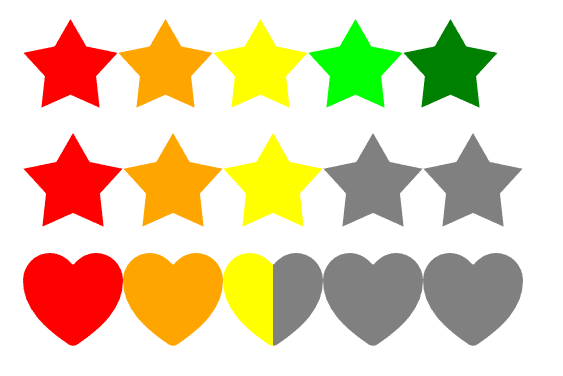

# Rating Indicator

## Currently v1.0.0


<br/>



# Installation For Html code:

#### Common HTML Page: `/index.js`<small>(Copy and paste at the end of the body tag)</small>
```bash

const ratingArray = document.querySelectorAll('.rating');
for (const eachRating of ratingArray) {
    const ratingValue = Number(eachRating.getAttribute('data-rating'))
    const ratingFloor = Math.floor(ratingValue);

    const ratingMultiply = (ratingValue - ratingFloor) * 10

    const ratingOr = ratingMultiply > 0 ? (ratingMultiply > 8 ? 2 : 1) : 0;


    const ratingSize = Number(eachRating.getAttribute('data-size'))

    const mask = eachRating.getAttribute('data-mask')


    const ratingFull = ['red', 'orange', 'yellow', 'lime', 'green'];
    const ratingHalf = ['red', 'red', 'orange', 'orange', 'yellow', 'yellow', 'lime', 'lime', 'green', 'green'];


    const ParentDiv = document.createElement('div')
    // ParentDiv.className = "rating";


    const ratingMode = eachRating.getAttribute('data-mode')
    if ((ratingMode == 'half')) {
        for (let index = 0; index < 10; index++) {

            const childElement = document.createElement('input');
            childElement.type = 'radio';
            childElement.disabled = true;
            childElement.style.cursor = 'default';


            //half rating//
            childElement.className = (index % 2 == 0 ? 'mask-half-1' : 'mask-half-2') + " mask  mask-" + (mask ? mask : 'star')
            childElement.style.backgroundColor = (((ratingFloor * 2) + ratingOr - 1) >= index ? ratingHalf[index] : 'grey')


            childElement.style.width = (ratingSize ? ratingSize : 16) - 10 + 'px'
            childElement.style.height = (ratingSize ? ratingSize : 16) + 'px'


            ParentDiv.appendChild(childElement)
        }
    }
    //full rating
    else {
        for (let index = 0; index < 5; index++) {

            const childElement = document.createElement('input');
            childElement.type = 'radio';
            childElement.disabled = true;
            childElement.style.cursor = 'default';

            //full rating//
            childElement.className = " mask  mask-" + (mask ? mask : 'star')

            childElement.style.backgroundColor = (((ratingFloor) - 1) >= index ? ratingFull[index] : 'gray');
            childElement.style.width = (ratingSize ? ratingSize : 16) + 'px'
            childElement.style.height = (ratingSize ? ratingSize : 16) + 'px'

            ParentDiv.appendChild(childElement)
        }
    }
    eachRating.appendChild(ParentDiv);

}

```

#### CSS style: `/style.css`


```bash

.rating {
    position: relative;
    display: flex;
}


.rating input {
    padding: 0px;
    margin: 0px;
    appearance: none;
    -webkit-appearance: none;
}


.rating input {
    height: 1rem;
    width: 0.375rem;
}


.mask {
    -webkit-mask-size: contain;
    mask-size: contain;
    -webkit-mask-repeat: no-repeat;
    mask-repeat: no-repeat;
    -webkit-mask-position: center;
    mask-position: center;
}

.mask-half-1 {
    -webkit-mask-size: 200%;
    mask-size: 200%;
    -webkit-mask-position: left;
    mask-position: left;
}

.mask-half-2 {
    -webkit-mask-size: 200%;
    mask-size: 200%;
    -webkit-mask-position: right;
    mask-position: right;
}


.mask-star {
    -webkit-mask-image: url("data:image/svg+xml,%3csvg width='192' height='180' xmlns='http://www.w3.org/2000/svg'%3e%3cpath fill='black' d='m96 153.044-58.779 26.243 7.02-63.513L.894 68.481l63.117-13.01L96 0l31.989 55.472 63.117 13.01-43.347 47.292 7.02 63.513z' fill-rule='evenodd'/%3e%3c/svg%3e");
    mask-image: url("data:image/svg+xml,%3csvg width='192' height='180' xmlns='http://www.w3.org/2000/svg'%3e%3cpath fill='black' d='m96 153.044-58.779 26.243 7.02-63.513L.894 68.481l63.117-13.01L96 0l31.989 55.472 63.117 13.01-43.347 47.292 7.02 63.513z' fill-rule='evenodd'/%3e%3c/svg%3e");
}

.mask-heart {
    -webkit-mask-image: url("data:image/svg+xml,%3csvg width='200' height='185' xmlns='http://www.w3.org/2000/svg'%3e%3cpath d='M100 184.606a15.384 15.384 0 0 1-8.653-2.678C53.565 156.28 37.205 138.695 28.182 127.7 8.952 104.264-.254 80.202.005 54.146.308 24.287 24.264 0 53.406 0c21.192 0 35.869 11.937 44.416 21.879a2.884 2.884 0 0 0 4.356 0C110.725 11.927 125.402 0 146.594 0c29.142 0 53.098 24.287 53.4 54.151.26 26.061-8.956 50.122-28.176 73.554-9.023 10.994-25.383 28.58-63.165 54.228a15.384 15.384 0 0 1-8.653 2.673Z' fill='black' fill-rule='nonzero'/%3e%3c/svg%3e");
    mask-image: url("data:image/svg+xml,%3csvg width='200' height='185' xmlns='http://www.w3.org/2000/svg'%3e%3cpath d='M100 184.606a15.384 15.384 0 0 1-8.653-2.678C53.565 156.28 37.205 138.695 28.182 127.7 8.952 104.264-.254 80.202.005 54.146.308 24.287 24.264 0 53.406 0c21.192 0 35.869 11.937 44.416 21.879a2.884 2.884 0 0 0 4.356 0C110.725 11.927 125.402 0 146.594 0c29.142 0 53.098 24.287 53.4 54.151.26 26.061-8.956 50.122-28.176 73.554-9.023 10.994-25.383 28.58-63.165 54.228a15.384 15.384 0 0 1-8.653 2.673Z' fill='black' fill-rule='nonzero'/%3e%3c/svg%3e");
}

```

### DEMO:
```bash
  <div class="rating" data-rating="2.1" data-mask="heart" data-size="20">
  </div>
```


<br/>

## Customize:

| Attribute         | Description                                        |
| ----------------- | -------------------------------------------------- |
| class="rating"    | This attribute given must                          |
| data-rating="2.1" | Rating Value                                       |
| data-mask="heart" | rating style . Default value `star`. value: `heart | star` |
| data-size="16"    | rating size . Default value `16px`.                |

>What you don't change, leave it blank and then use commas. Customize his next style. like: data-scroll="[, , ]  


<!-- 

# For React App:


## Installation

Create a file in a `/src` like: `scrollBar.js`

copy index.js code and paste scrollBar.js file

Paste at the the `/src/scrollBar.js`:
```bash
<script src="./scriptScrollBar.js">
</script>
```
Paste at the `/src/index.js`:
```bash
 import './scrollBar'
```

## Customize:

| data-scroll="[scroll-color,bg-color,height] | Description                                                                               |
| ------------------------------------------- | ----------------------------------------------------------------------------------------- |
| data-scroll="[red, blue, 5]                 | here Scroll-color: red, bg-color: blue, height: 5                                         |
| data-scroll="[, , 5]                        | unless you want to change style, please follow it. `Here only height custom style apply ` |
| data-scroll="[, , ]                         | unless you want to change style, please follow it. `Here no custom style apply `          |

>What you don't change, leave it blank and then use commas. Customize his next style. like: data-scroll="[, , ]   -->

